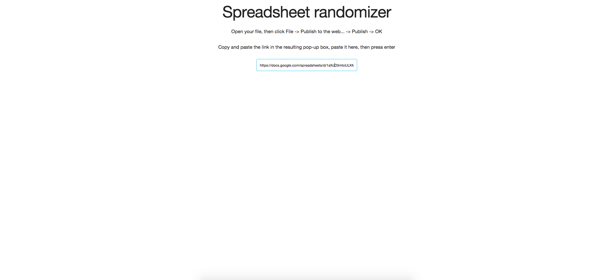
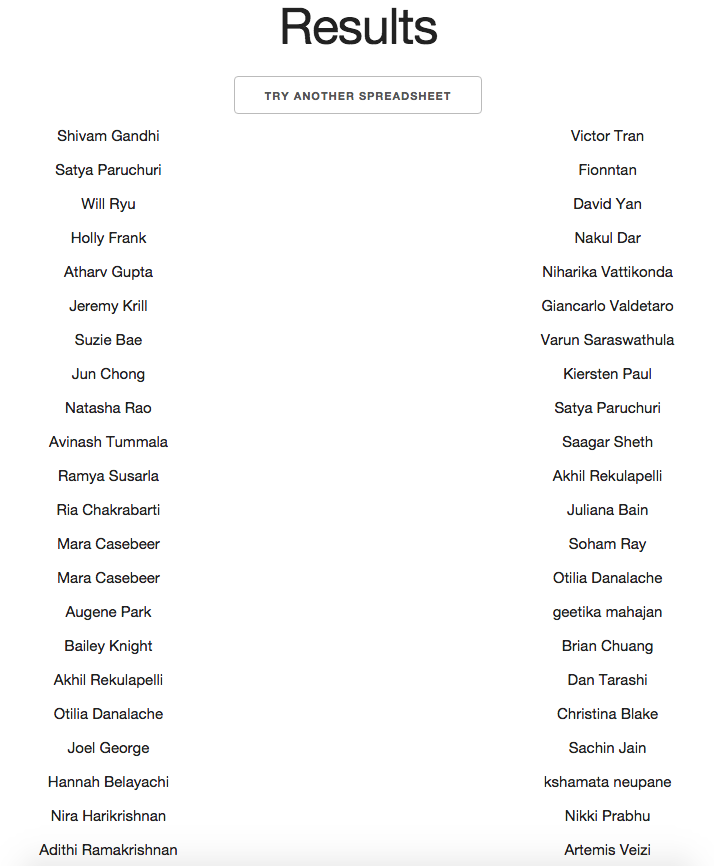

#Google Spreadsheet Randomizer

Taken down names through a google form for a secret santa or some sort of similar game? Randomize them automatically!

##Use cases
 - Secret Santa
 - Sock Wars
 - Any game in which you need to match up pairs of people randomly

##Features
 - Automatically randomize names
 - Ensure there are no collisions (you are never matched with yourself)
 - Copy and paste the resulting column of names into your spreadsheet and the names will match up
 - Refresh for a new set of pairings

##Preparing your google doc
 - Click File -> Publish To Web -> Publish
 - Open the link you are given in a new tab and copy the entire URL that you are given

##Usage
 - Make sure you have [NodeJS](https://nodejs.org/en/) installed
 - Clone the repo
 - Run the app by running `node app.js`
 - Navigate your browser `http://localhost:3000/`
 - Follow the steps with your google doc, and press enter
 - ???
 - Profit.

##Contributing

Since this is such a simple project and is going to be used by pretty non-technical people, I am trying to make it as easy to use and contribute to. If you're relatively new to open source, this is a great project to start on, especially if you know basic javascript. Let me know if you would like to help or just check out the [Issues](https://github.com/2016rshah/secret-santa/issues) tab. 